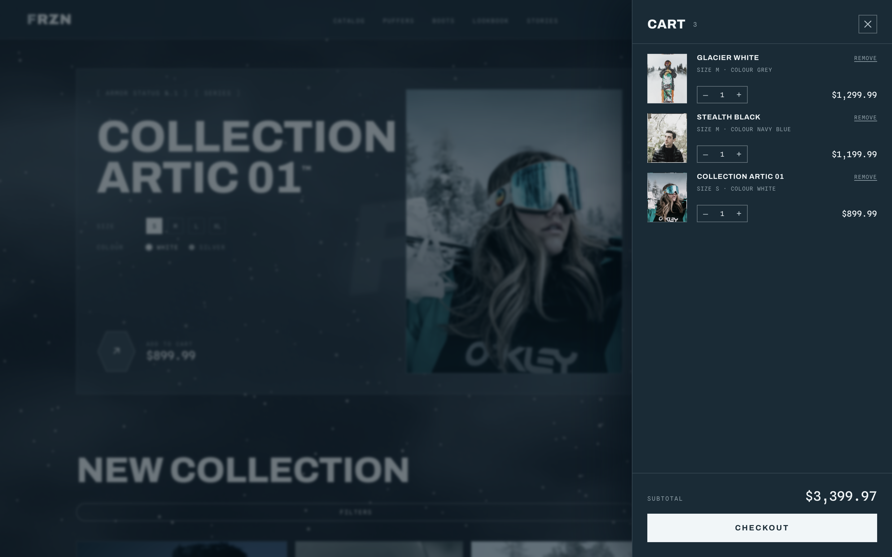
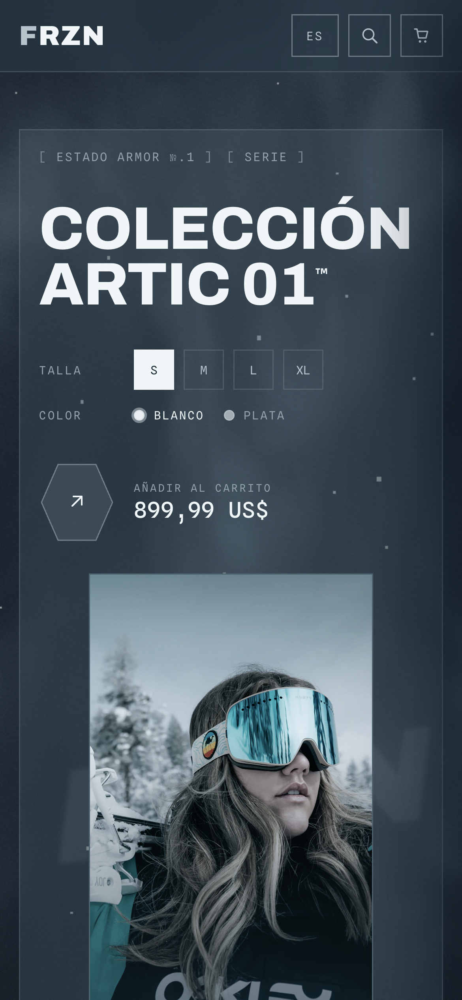
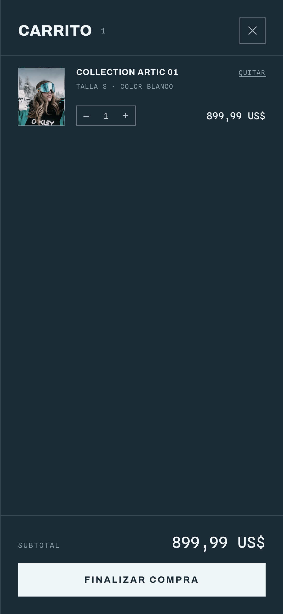

# Winter Store

Concept e-commerce front-end for a winter outerwear brand (FRZN — Artic 01). Built it to push image-heavy product pages that still feel fast, with a working cart and language detection out of the box.


## Cart

Add to cart works from the hero, the featured block and every product card. Lines are grouped by size + colour, quantities update live, and the whole cart is persisted to `localStorage` so it survives a refresh. Prices are formatted per locale.



## Mobile

Single layout that adapts down to phones — touch targets, full-width cart, safe-area padding.

<p>
  
  
</p>

## Stack

- React 18 + Vite
- three.js / @react-three/fiber for the animated frozen background (snow + fog shader)
- GSAP + ScrollTrigger for the scroll reveals and parallax
- Plain CSS with custom properties (OKLCH colour system), no UI framework

## Notes

- **Language**: detected from the browser on load (English / Spanish / French / German), with a manual switch in the header. Choice is remembered.
- **Images**: all served locally as WebP at the exact sizes used, with a 1× / 2× srcSet and an inline base64 blur placeholder so nothing pops in while scrolling. Run `npm run images` to regenerate them.
- **WebGL** is lazy-loaded, capped on mobile, and skipped entirely when the user prefers reduced motion. A CSS gradient takes over if the canvas can't start.

## Run it

```bash
npm install
npm run dev
```

Other scripts:

```bash
npm run build       # production build
npm run images      # refetch + optimise product imagery
npm run shots       # regenerate the screenshots above (needs the dev server running)
```
